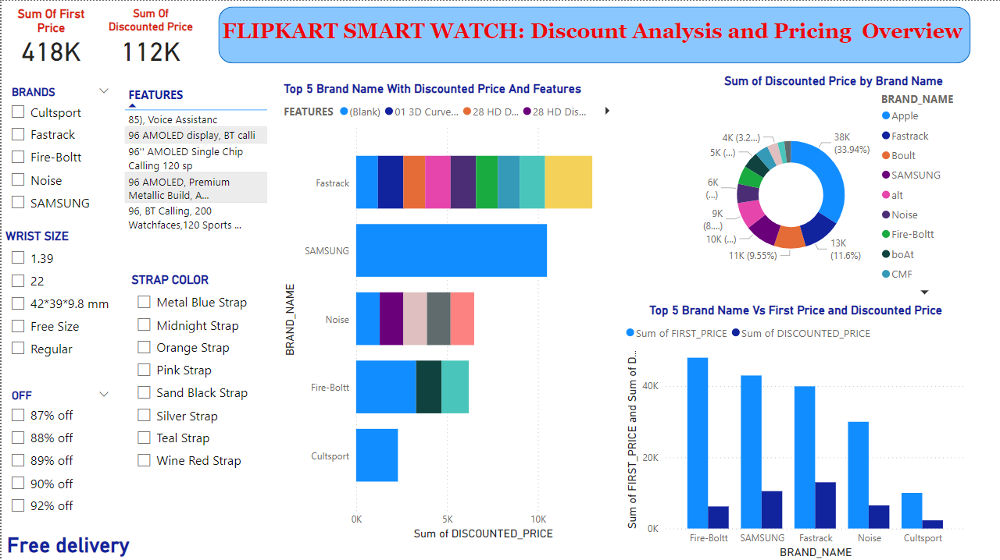
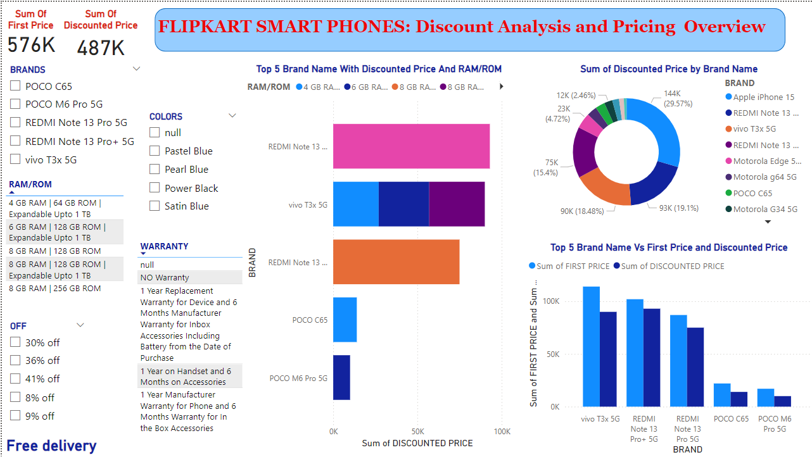

# Flipkart Sales Analysis Project

## Overview
This project involves analyzing sales data from Flipkart for three categories: Handbags, SmartWatches, and SmartPhones. The data has been extracted/scraped from Flipkart's website and visualized using Power BI to provide insights into discount patterns and pricing strategies.

## Files and Structure
- **Flipkart_Sales_Analysis_Project/**
  - **Flipkart_Sales_Analysis.pbix**: Power BI file containing the analysis and visualizations.
  - **Flipkart_Handbags_Data.xlsx**: Excel file with raw data for handbags.
  - **Flipkart_SmartWatch_Data.xlsx**: Excel file with raw data for smartwatches.
  - **Flipkart_SmartPhones_Data.xlsx**: Excel file with raw data for smartphones.

## Pages in Power BI Report
1. **FLIPKART HANDBAGS: Discount Analysis and Pricing Overview**
   - Provides a detailed analysis of discounts and pricing for handbags on Flipkart.
   
2. **FLIPKART SmartWatch: Discount Analysis and Pricing Overview**
   - Offers insights into the discount trends and pricing for smartwatches on Flipkart.
   
3. **FLIPKART SmartPhones: Discount Analysis and Pricing Overview**
   - Analyzes the discount patterns and pricing for smartphones on Flipkart.
   

## Data Extraction Process
The data was extracted from Flipkart using the URLs of the respective product pages. The extraction was performed using Power BI's data scraping capabilities, and the raw data was saved into separate Excel files for each product category.
